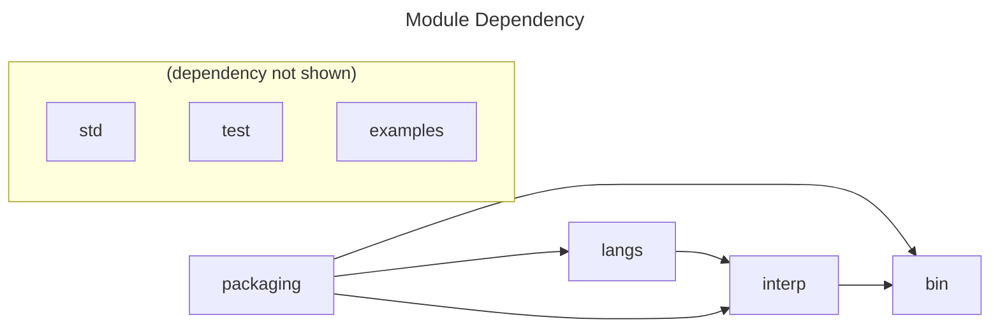

# Intro

This repo is the code for projects studying package managers and programming languages. It includes code and examples for these topics:

- **Package Managers a la Carte (Project P)**: provide building blocks a.k.a. module and modules functors for common package managers, including packages, package managers, storage backends, versioning, and commandline interfaces. With designed configurations, one can derive either full-fledged complete package managers, or drop-in replacement to intergrate with existing package managers.

  - **Language Enhancing (Project L)**: demonstrate how to enhance toy language e.g. $λ_{text}$, a naive plaintext language, $λ_{md}$, markdown with packaging, and $λ_{boat}$, a lambda calculus like language. The project target to enhance practical languages to get benefit from packaging support.

- **Resolving a la Carte (Project R)**: a formal specification and mechanism to interpret resolving in system and package management. The project argues that all resolving phenomena can described in a unified way with a few basic concepts, which happens to be a lambda calculus with record variants. The project also ships with a $λ_{record}$ to demonstrate the concepts.

- **Programming Language Ecology (Projectg E)**: currently the project focuses a DSL $λ_{sandpiper}$ having primitives for package management and resolving. The DSL is a thin wrapper over existing package managers and command-line tools including shell and binutils etc. The DSL can be translated (compiled) to shell scripts. With the modeling of package managers and resolving, the DSL can convert the pre-and-post conditions of their actions into checkable assertions along with the generated scripts.

# Environment Init

```console
opam install . --deps-only --with-test
dune build
```

# Project Structure

The top-level directories follows the common structure for source code `src`, tests `test` , document `doc`, and prepared examples and external resources `vendor`.

```
project_root/
├── src/
├── test/
├── doc/
├── vendor/
│
├── _build/              # dune build default
├── _out/                # tola build and output
└── _pm/                 # package manager stores
    ├── root/
    └── cache/
```

The directories that are related to package manager and resolving machanism studies:

- `packaging`: definitions for packages and package managers
- `langs` : language ASTs
- `interp` : interpreters and concrete package managers
- `bin` : executables.
- `std` : project-level standard library
- `test` : tests

The directories that are less relevant recently:

- `ainterp`: abstract interpretation
- `examples`: some language expressions

# Extending a Language with Packaging Support

We are interested not only in studying existing package managers, but also enhancing languages with packaging support.

The user should be able to specify their choices à la carte with a config file (pure dynamic), or with code (pure static). The choices should also cover the combination of the features and the toolchain of the target language.

# `tola` Commandline Tool Usage

# Glossary (t.b.c.)

**Below are legacy README. A new one is being written.**

# Intro 

This is an ambitious repo as a Programming Language (PL) framework to study and experiment for common concepts and constructs. 

The repo is original created to provide basic demos and interfaces for tools and definitions in PL eco-system.

The code favors a (module) functor-based approach and components used in it can be plug-ed from a basic implementation to a sophisticated one.

The code is also intended to provided pure interfaces to be applied in other projects.

Currently, the repo is for modeling the design space of package managers.

# Project Structure



# Some Code Explanation

## Packaging in the Code

`packaging/package.ml` defines the module signature `PACKAGE` and a concrete `String_pkg` whose package id `pid` and package content `pkg` are just strings.

Two package managers are defined in `packaging/naive_manager.ml` and `packaging/basic_manager.ml` respectively. Each manager e.g. the basie one defines a module interface `BASIC_MANAGER` and a `Make` functor to derive a concrete package manager from the provided `PACKAGE`, storage `STORE`, and configuration for paths `BASIC_CONFIG`. A _Naive_ package manager is somewhat a simplest manager working with a language with packaging: just a local store with marshaled data. A _Basic_ package manager is a package manager with local and remote stores which are just two directories.

Aside: `Make` functor is a common OCaml approach to abstract over concrete implementations.

`packaging/cmd.ml` provides a functor to derive the commandline interface from the package manager.

## Demo Language $λ_{text}$

$λ_{text}$ is a naive plaintext language with one new syntax `@id@`. `id` is a package id and the interpreter will replace itwith the package content (which is also a plaintext).

e.g.

```
{ac->"Axiom of Choices"} |- [["I believe @ac@."]] => I believe Axiom of Choices.
{ac->"Axiom of Choices"; zfc->"Zermelo–Fraenkel set theory"} |- [["I believe @ac@ but not @zfc@."]] => "I believe Axiom of Choices but not Zermelo–Fraenkel set theory".
```

$λ_{text}$ is for prototyping the framework. It works as a precursor before experimenting on _much more fancy_ languages e.g. markdown or bash.

<!-- # Targets

The repo is going to support the writing of _PL: some small pieces_ blog.

The code in the repo is divided into interfaces, which can work as a collection of well-defined PL basic.

The code can also demostrate that PL tools and components follow (not-too-many) algorithms, and provide these as a libray.

I hope the repo can work as playground which people can try and test old and new ideas.

Last, I hope the repo can be practical by adapting some protocals then even toy languages can have all toolchains. -->

## $λ_{text}$ in the Code

`langs/text.ml` gives a package-free AST in module `Plain` and a with-package AST in module functor `Make`. It can be an analogy for later when we have a vanilla bash AST and with-package bash AST.

The `Make` here may seem overdesigned. Let's tolerate it now and wait for future refactoring from `Version Algebra`.

`interp/text/text_plain_interp.ml` defines a normal interpreter. `interp/text/text_with_pkgm.ml` defines two package-manager-powered interpreter. Two concrete package managers are made here `Naive_pkgm` and `Basic_pkgm`. I was just demoing the _Basic_ package manager therefore just one `Interp` is made here for `Basic_pkgm`.

## Executables

Due to the fact that `dune` are restricted on code in executables, it's prefer to have less code in them.

`bin/pkgm_naive/bpm.ml` is the commandline interface for $λ_{text}$'s _Basic_ package manager. `bin/pkgm_naive/npm.ml` is the commandline interface for $λ_{text}$'s _Naive_ package manager. `bin/pkgm_naive/text.ml` is the interpreter for $λ_{text}$ coupled with _Basic_ package manager. Each of these file contain just a few lines to code since the work is done in `packaging` and `interp`.

# Run

The project is written in OCaml. Therefore, unavoidably, you need to have ocaml toolchains (`ocaml` `opam` and `dune`) installed. A recent updated instructions is at [https://pl.cs.jhu.edu/fpse/coding.html]. Follow the first two sections on installing `ocaml` and `opam`.


To build everything:

```shell
$ opam install dune

# This will fail but generate a `tola.opam` file with dependencies
$ dune build

# The bash parser `morbig` fixed non-exist bug in the dev repo
$ opam pin morbig git+https://github.com/colis-anr/morbig.git

# Ignore the warnings and press _y_ when prompted
$ opam install . --deps-only --with-test
```

To prepare sample packages for playing around:

```shell
$ make pkg_init
```

We have two ways to run OCaml binaries:

```shell
# Run the compiled binary
$ ./bin/bpm.exe info

# or, after changing code, re-compile and run
$ dune exec bin/bpm.exe -- info
```

To let $λ_{text}$ interpreter code:

```shell
$ echo Tell me about @ac@. | ./bin/text.exe
# Tell me about Axiom of Choices
```

The full supported commands are defined at the end of `packaging/cmd.ml`.

Here are some examples. For local package managing, we can

```shell
$ ./bin/bpm.exe i me "a cat"
# installed me a cat

$ echo It\'s @me@. | ./bin/text.exe
# It's a cat.

$ ./bin/bpm.exe u me
# uninstalled me

$ echo It\'s @me@. | ./bin/text.exe
# Uncaught exception: Not_found

$ ./bin/bpm.exe info
# #pkg = 1
# ac
```

For remote package managing and local-remote interaction, we can

```shell
$ ./bin/bpm.exe p nick Songsong
# published nick Songsong

$ ./bin/bpm.exe f nick
# fetch nick

$ echo My nickname is @nick@. | ./bin/text.exe
# My nickname is Songsong.
```

## To-do

Interesting backends:

- File system
- Git repo
- GitHub Packages
- In-memory db
- S3