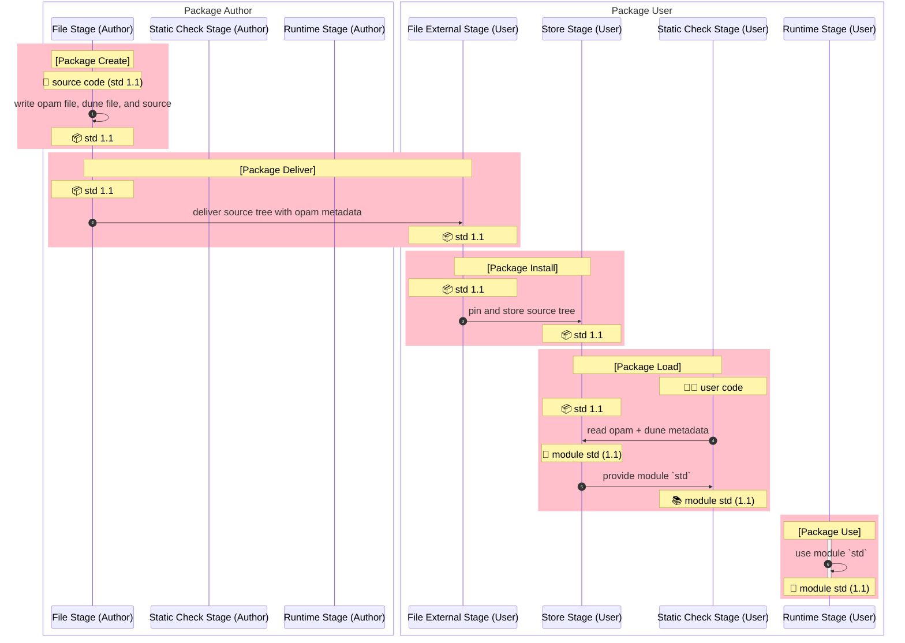

```mermaid
%%{ init: {
  'sequence': { 'showSequenceNumbers': true },
  'fontSize': '28px',
  'themeVariables': {
    'fontSize': '28px',
    'fontFamily': 'monospace',
    'textAlign': 'center',
    'wrap': true
  }
} }%%
sequenceDiagram
    box Package Author
      participant AuthorFile as File Stage (Author)
      participant AuthorStaticCheck as Static Check Stage (Author)
      participant AuthorRuntime as Runtime Stage (Author)
    end

    box Package User
      participant UserFileExternal as File External Stage (User)
      participant UserStore as Store Stage (User)
      participant UserStaticCheck as Static Check Stage (User)
      participant UserRuntime as Runtime Stage (User)
    end

    rect pink
      Note over AuthorFile: [Package Create]
      Note over AuthorFile: 🧾 source code (std 1.1)
      AuthorFile->>AuthorFile: write opam file, dune file, and source
      Note over AuthorFile: 📦 std 1.1
    end

    rect pink
      Note over AuthorFile, UserFileExternal: [Package Deliver]
      Note over AuthorFile: 📦 std 1.1
      AuthorFile->>UserFileExternal: deliver source tree with opam metadata
      Note over UserFileExternal: 📦 std 1.1
    end

    rect pink
      Note over UserFileExternal, UserStore: [Package Install]
      Note over UserFileExternal: 📦 std 1.1
      UserFileExternal->>UserStore: pin and store source tree
      Note over UserStore: 📦 std 1.1
    end

    rect pink
      Note over UserStore, UserStaticCheck: [Package Load]
      Note over UserStaticCheck: 🧾🔖 user code
      Note over UserStore: 📦 std 1.1
      UserStaticCheck->>UserStore: read opam + dune metadata
      Note over UserStore: 📘 module std (1.1)
      UserStore->>UserStaticCheck: provide module `std`
      Note over UserStaticCheck: 📚 module std (1.1)
    end

    rect pink
      Note over UserRuntime: [Package Use]
      activate UserRuntime
      UserRuntime->>UserRuntime: use module `std`
      Note over UserRuntime: 📖 module std (1.1)
      deactivate UserRuntime
    end

```